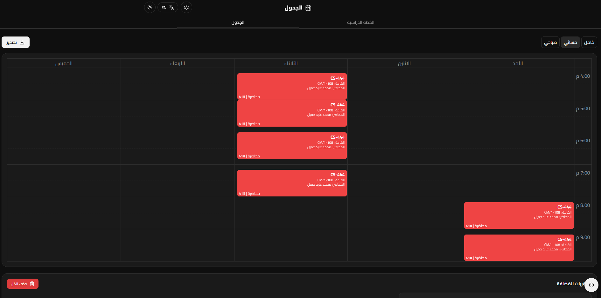
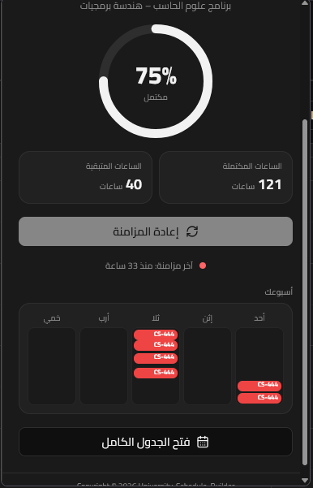
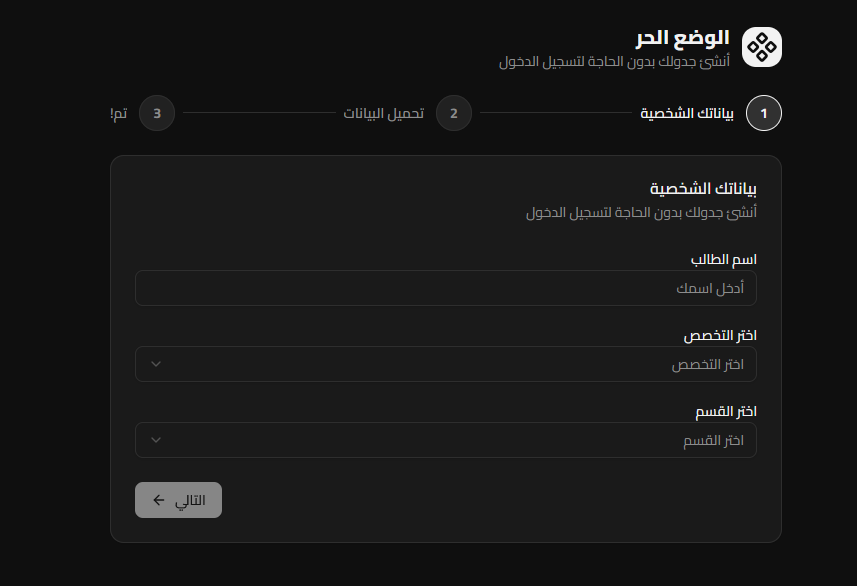
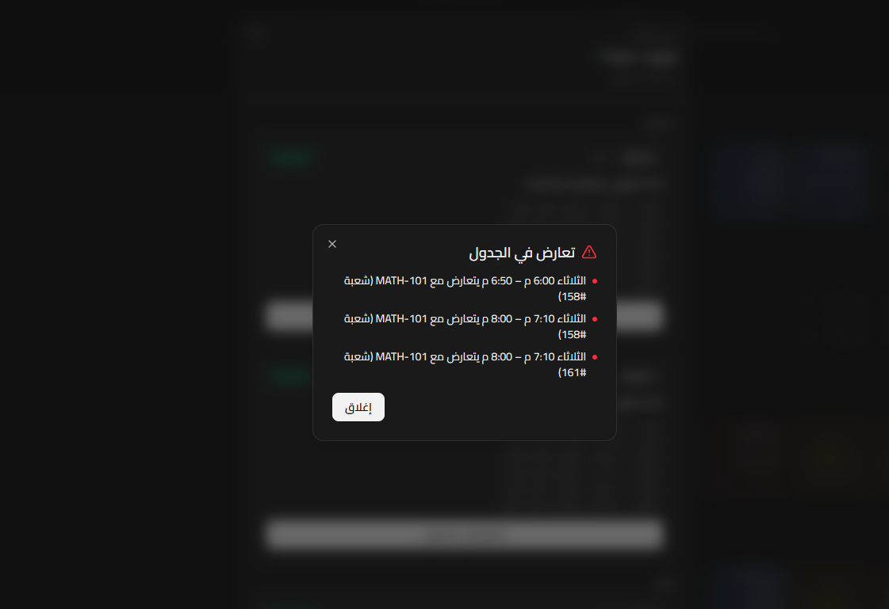
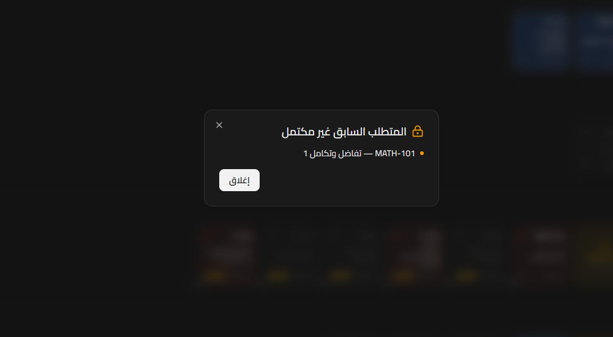
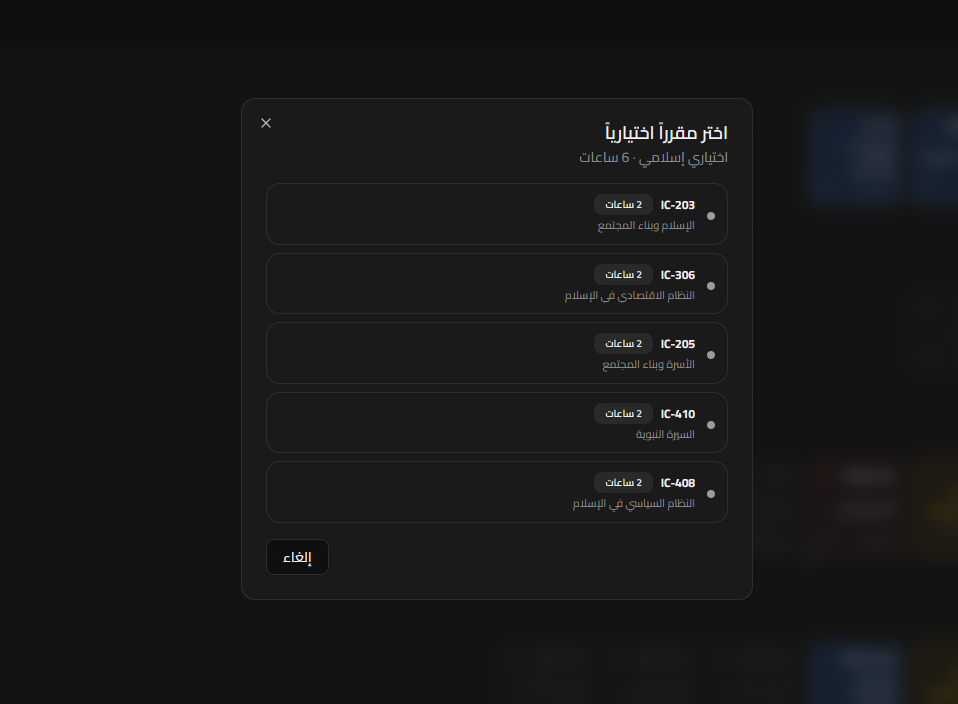
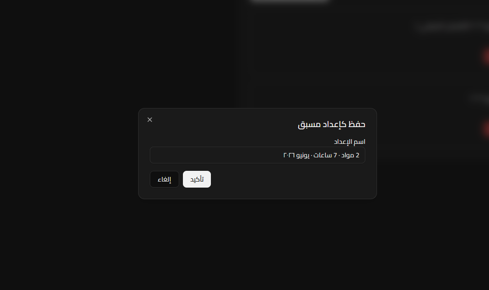
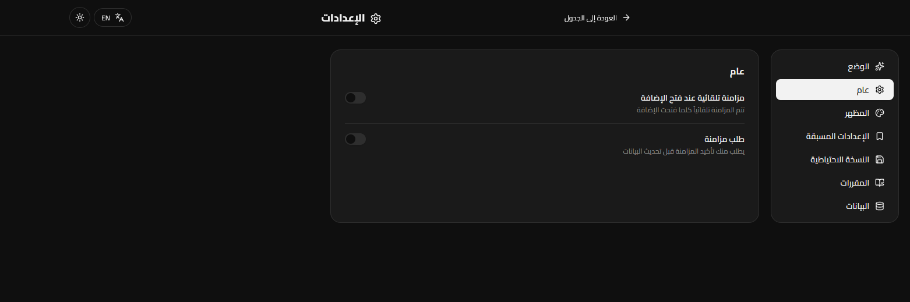

### 🛠️ رتّب جدولك الأكاديمي بكل سهولة!

 

[ليش تستخدم USB؟](#ليش-تستخدم-usb) &middot; [أبرز المزايا والخصائص](#أبرز-المزايا-والخصائص) &middot; [معاينة النظام (لقطات الشاشة)](#معاينة-النظام-لقطات-الشاشة) &middot; [بروتوكول الخصوصية والأمان](#بروتوكول-الخصوصية-والأمان) &middot; [دليل التثبيت](#دليل-التثبيت) &middot; [الأسئلة الشائعة FAQ](#الأسئلة-الشائعة-faq) &middot; [الدعم الفني وقنوات التواصل](#الدعم-الفني-وقنوات-التواصل) &middot; [English](./README.en.md)

 

> [!IMPORTANT]
> **بيان الشفافية الرقمية:** مشروع USB عبارة عن مبادرة طلابية مستقلة وغير رسمية بنسبة 100%. تم تطوير النظام بواسطة طالب من جامعة المستقبل بمنطقة القصيم بهدف تسهيل العمليات الأكاديمية وتحسين تجربة تسجيل الجداول للطلاب والطالبات. النظام **لا يتبع** لجامعة المستقبل ولا يخضع لإشرافها. هذا المستودع مخصص للأدلة والبيانات فقط، والكود المصدري غير متاح هنا حالياً، ويتم رفع التحديثات مباشرة عبر المتاجر الرسمية أو كملفات مضغوطة موثقة في صفحة [الإصدارات][releases].

> [!WARNING]
> **تنبيه أمني هام:** نظام USB لا يمتلك أي قنوات على منصة Discord. المنصات الرسمية المعتمدة هي مجتمع التيليجرام وقسم الـ [Issues على GitHub][issues] فقط. إذا واجهت أي جهة أو حساب يطلب منك مبالغ مالية، أو كلمات المرور الخاصة ببوابتك الأكاديمية (الخدمات الذاتية) باسم USB، يرجى تجاهله فوراً والإبلاغ عنه، فنحن لا نطلب هذه البيانات مطلقاً.

<kbd>فهرس المحتويات (Navigation)</kbd>

 

- [ليش تستخدم USB؟](#ليش-تستخدم-usb)
- [أبرز المزايا والخصائص](#أبرز-المزايا-والخصائص)
- [معاينة النظام (لقطات الشاشة)](#معاينة-النظام-لقطات-الشاشة)
- [بروتوكول الخصوصية والأمان](#بروتوكول-الخصوصية-والأمان)
- [دليل التثبيت](#دليل-التثبيت)
- [الأسئلة الشائعة FAQ](#الأسئلة-الشائعة-faq)
- [الدعم الفني وقنوات التواصل](#الدعم-الفني-وقنوات-التواصل)
- [المساهمة وتطوير النظام](#المساهمة-وتطوير-النظام)
- [إخلاء المسؤولية القانونية](#إخلاء-المسؤولية-القانونية)
- [الترخيص](#الترخيص)

 

## ليش تستخدم USB؟

تستخدم اضافة **USB (University Schedule Builder)** كحل ذكي مدعوم بأتمتة مرنة؛ النظام يمسك خطتك الدراسية والشعب المطروحة بالترم الحالي، ويحولها لك لجدول أسبوعي تفاعلي متكامل. تقدر تبني جدولك وتختبر تعارض الأوقات وتضبط أمورك.

* **خيارات وصول مرنة (Dual-Mode):** 
    * *وضع المزامنة (Sync Mode):* يسجل دخول آمن عبر متصفحك ويسحب خطتك الفعلية وشعبك الحالية.
    * *الوضع الحر (Free Mode):* ما يحتاج أي تسجيل دخول! حدد تخصصك (هندسة، حاسب، هندسة برمجيات... إلخ) وابدأ بناء جدولك مباشرة.
* **خوارزمية رصد التعارض المبكر:** يكتشف تداخل الأوقات بين الشعب فوراً وقبل ما تجرب في موقع الجامعة.
* **محلل المتطلبات السابقة الذكي:** بطاقة المقرر تقلب أحمر تلقائياً إذا كان فيه مادة متطلبة ما بعد اجتزتها، ويعطيك تنبية باسم المادة الي ما اجتزتها.
* **أتمتة المواد الاختيارية (Electives):** خانات المواد الاختيارية بالخطة صممت لتكون ذكية وقابلة للنقر؛ تفتح لك قائمة المواد المرتبطة بالمجموعة الصحيحة مباشرة بدون لف ودوران.
* **بيئة تخزين محلية وآمنة (Local Storage):** النظام يشتغل بالكامل داخل متصفحك الشخصي. لا نرفع بياناتك ولا نملك خوادم وسيطة، شغلك كله بجهازك.
* **نظام الحفظ المسبق (Presets):** تقدر تحفظ أكثر من نسخة ومسودة لجدولك (مثلاً: جدول صباحي، جدول بدون يوم الخميس) وتقارن بينها وتختار الأفضل لك.
* **دعم اللغتين والاتجاهات:** واجهة مستخدم متطورة تدعم العربية والإنجليزية (RTL / LTR) مع أداء سلس وسريع بدون أي مشاكل في التحميل أو العرض.

<a href="#readme-top">&#9650; العودة للأعلى</a>

## أبرز المزايا والخصائص

<table dir="rtl">
<tr>
<td width="33%" valign="top" align="right">

**🗂️ هندسة وهيكلة الخطط**

وضع المزامنة يجلب خطتك الأكاديمية الرسمية من البوابة مباشرة. والوضع الحر يتيح لك بناء جدولك بدون حساب؛ فقط اختر تخصصك، القسم، وابدأ فوراً.

</td>
<td width="33%" valign="top" align="right">

**⚡ كشف المشاكل والأخطاء مبكراً**

نظام ذكي يمنعك من إضافة شعب متداخلة بالأوقات ويحذرك منها. مع فحص فوري ومباشر للمتطلبات السابقة لكل مادة للتأكد من أهليتك لتسجيلها.

</td>
<td width="33%" valign="top" align="right">

**🎨 تخصيص مرن وتصدير سريع**

تخصيص كامل لواجهة العرض، حفظ مسودات متعددة بأسماء مخصصة، وإمكانية تصدير جدولك النهائي كصورة عالية الجودة PNG أو نسخ نصي مرتب لمشاركته مع زملائك.

</td>
</tr>
</table>

| الميزة / المكون الدراسي | الوصف الوظيفي والتقني |
|---|---|
| **وضع المزامنة (Sync Mode)** | يتكامل مع بوابة الطالب الأكاديمية لسحب الخطة الفردية (المواد المجتازة والمتبقية) والشعب المتاحة للترم الحالي، وتخزينها محلياً على جهازك بشكل آمن. |
| **الوضع الحر (Free Mode)** | تشغيل فوري بدون حساب. يقرأ النظام خطة تخصصك من قاعدة بيانات داخلية مدمجة مع جلب أوقات الشعب من جدول الزوار العام بالجامعة. |
| **الجدول الأسبوعي التفاعلي** | شاشة عرض متطورة تدعم فترات زمنية مرنة: الفترة الصباحية (08:00–15:00)، المسائية (16:00–22:00)، أو اليوم الكامل. |
| **لوحة الأسبوع المصغرة (Popup)** | واجهة سريعة ومدمجة تظهر عند النقر على أيقونة الإضافة بالمتصفح، تعرض لك توزيع موادك الحالي دون الحاجة لفتح النظام بالكامل. |
| **خوارزمية منع التعارض** | حارس ذكي يراقب التوقيت؛ يعطيك تنبيه فوري إذا حاولت تختار شعبة تتعارض مع وقت مادة تم اختيارها مسبقاً. |
| **مراقب المتطلبات الأكاديمية** | تلوين بطاقة المادة بالأحمر عند عدم استيفاء متطلباتها السابقة، مع توفير زر معلومات يعرض لك تفصيلاً حالة النجاح/الرسوب لكل متطلب مسبق. |
| **معالج المواد الاختيارية** | يحول المواد الحرة والاختيارية بالخطة إلى أزرار ذكية تعرض لك فقط المواد المتاح لك تسجيلها وضمن االقسم الصحيح. |
| **مؤشر إكمال المستويات** | يتيح لك بالوضع الحر تحديد مواد معينة أو مستويات كاملة (مثل التحضيري أو المستوى الثالث) كمجتازة لتحديث حالة الخطة بدقة. |
| **إدارة المسودات (Presets)** | يتيح لك حفظ عدة سيناريوهات للجداول؛ ويقترح النظام اسم تلقائي ذكي للمسودة يعتمد على عدد الساعات، المواد، والشهر الحالي. |
| **نظام النسخ الاحتياطي (Snapshot)** | يأخذ لقطة ثابتة من شعب المواد المطروحة، عشان لو علقت بوابة الجامعة أو صار تحديث مؤقت بالجدول، ما تضيع تضبيطاتك وجدولك اللي تعبت عليه. |
| **الأتمتة والمزامنة التلقائية** | بمجرد فتح إضافة المتصفح وأنت بتبويب البوابة، يتم تحديث البيانات بالخلفية بشكل تلقائي ذكي (بحد أقصى مرة كل 5 دقائق لمنع الضغط). |
| **تحديثات الخطط الصامتة** | فحص دوري بالخلفية لتحديث الخطط الدراسية وتعديلاتها بطلب من المطورين، مع ميزة العمل دون اتصال بالإنترنت (Offline Mode). |
| **دعم الهوية البصرية اللغوية** | واجهة معربة بالكامل ومتوافقة مع معايير RTL، مع ميزة التبديل للإنجليزية وحفظ تفضيلات المستخدم (اللغة والثيم) تلقائياً. |
| **أدوات التصدير والمشاركة** | استخراج الجدول النهائي بنقرة زر كصورة PNG عالية الدقة، أو نسخه كصيغة نصية منسقة لإرسالها. |

<a href="#readme-top">&#9650; العودة للأعلى</a>

## معاينة النظام (لقطات الشاشة)

<table dir="rtl">
<tr>
<td width="50%" align="center">
 
<b>الواجهة الرئيسية للجدول (وضع المزامنة)</b> &middot; استعراض كامل للجدول بعد سحب البيانات، مع خيارات التحكم بالفترات (صباحي/مسائي).
</td>
<td width="50%" align="center">
 
<b>أيقونة الإضافة المصغرة (Popup View)</b> &middot; نظرة سريعة ومختصرة على جدولك الدراسي مباشرة من شريط الأدوات بالمتصفح.
</td>
</tr>
<tr>
<td width="50%" align="center">
 
<b>إعدادات التشغيل السريع للوضع الحر</b> &middot; شاشة اختيار التخصص الأكاديمي وتحديد القسم لبناء الخطة فوراً وبدون حساب.
</td>
<td width="50%" align="center">
 
<b>مؤشر رصد التعارض الزمني</b> &middot; تنبيه حرج يظهر فوراً لمنع تداخل أوقات المحاضرات والشعب الدراسية.
</td>
</tr>
<tr>
<td width="50%" align="center">
 
<b>نافذة فحص المتطلبات السابقة</b> &middot; تلوين المادة غير المستوفية للشروط باللون الأحمر مع تفصيل النواقص الأكاديمية.
</td>
<td width="50%" align="center">
 
<b>محدد المواد الحرة والاختيارية</b> &middot; واجهة منبثقة ذكية لتسهيل اختيار المقررات الاختيارية من الاقسام المعتمدة بالجامعة.
</td>
</tr>
<tr>
<td width="50%" align="center">
 
<b>لوحة التحكم بالمسودات (Presets)</b> &middot; حفظ واسترجاع نسخ الجداول المقترحة وتسميتها تلقائياً حسب الساعات المعتمدة.
</td>
<td width="50%" align="center">
 
<b>لوحة الإعدادات العامة</b> &middot; تخصيص اللغات، الثيمات، وإجبار النظام على فحص تحديثات الخطط الدراسية.
</td>
</tr>
</table>

 

<a href="#readme-top">&#9650; العودة للأعلى</a>

## بروتوكول الخصوصية والأمان

* **انعدام التتبع والتحليلات (Zero-Tracking):** لا يقوم نظام USB بجمع، أو مراقبة، أو إرسال أي بيانات تتعلق بسلوكك الأكاديمي أو استخدامك للنظام لأي خوادم خارجية.
* **تكامل الجلسة المحلي المتزامن:** في وضع المزامنة، يتم الاتصال بالبوابة الرسمية للجامعة من خلال جلسة متصفحك الحالية والخاصة بك تماماً. لا يتم وسيطة هذه البيانات عبر خادم (Server) خاص بنا، لعدم وجود خادم أصلاً!
* **مبدأ التخزين المحلي الآمن:** كافة تفاصيل خطتك، الشعب المحددة، الجداول المحفوظة، وتفضيلاتك الشخصية تُخزن بالكامل في الـ Local Storage الخاص بمتصفحك فقط.
* **سرية هويتك بالوضع الحر:** عند استخدامك للوضع الحر، يعمل النظام بكفاءة تامة ودون الحاجة لطلب اسمك الحقيقي أو رقمك الجامعي أو أي جلسة نشطة.
* **أمن بيانات الدخول:** تذكر دائماً أن حماية بيانات تسجيل دخولك هي مسؤوليتك الشخصية؛ ونظامنا مصمم برمجياً بحيث لا يرى ولا يحفظ كلمات المرور الخاصة بك.

<a href="#readme-top">&#9650; العودة للأعلى</a>

## دليل التثبيت

| المتصفح المستهدف | حالة التوفر والتحميل |
|---|---|
| **Mozilla Firefox** | متاح حالياً وبشكل رسمي على متجر [addons.mozilla.org][firefox-amo] - ابحث عن اسم الإضافة المعتمد أو اضغط الرابط للتوجه المباشر. |
| **Google Chrome** | قيد المراجعة الفنية والأمنية بمراجعات متجر كروم. سيتم إطلاق الرابط فوراً، وننشر التحديثات اللحظية عبر [قناة التيليجرام][telegram]. |
| **النسخ اليدوية المستقلة** | سيتم توفير ملفات `.zip` الموقعة رقمياً لكافة المتصفحات في صفحة [الإصدارات][releases] فور جاهزيتها. (تذكير: المستودع لا يحتوي كود الإضافة المصدري). |

<a href="#readme-top">&#9650; العودة للأعلى</a>

## الأسئلة الشائعة FAQ

**س: هل يقوم نظام USB بحفظ أو إرسال الرقم السري لبوابتي الجامعية لأي خادم؟** ج: مستحيل طبعاً. وضع المزامنة يعتمد كلياً على جلسة متصفحك المفتوحة والآمنة أساساً. لا يتم حفظ أو إرسال أي بيانات دخول خارج جهازك، والنظام مصمم ليعمل بدون خادم وسيط (Serverless Architecture).

**س: هل يلزمني أسجل دخولي الرسمي عشان أستفيد من خدمات USB؟**   
ج: لا ما يحتاج. تقدر تستخدم "الوضع الحر" مباشرة؛ حدد التخصص والمسار الدراسي واشتغل على جدولك فوراً، مع العلم أن أوقات الشعب بالوضع الحر تعتمد على جداول الزوار العامة المتاحة للجميع مع التنوية ان الخطط في الوضع الحر تعتمد على احدث نسخة من خطط التخصص تأكد من خطتك في البوابة او استعمل وضع المزامنة لسحب الخطة القديمة من البوابة.

**س: هل مشروع USB معتمد رسمياً من قِبل إدارة جامعة المستقبل؟**  
ج: لا، هو عمل وتطوير طلابي مستقل بجهود شخصية لخدمة زملائنا وزميلاتنا الطلاب لتسهيل التسجيل، وليس جهة رسمية تابعة للجامعة.

**س: ليش نسخة متصفح كروم ما نزلت حتى الآن؟**  
ج: النسخة بانتظار انتهاء الفحص الأمني وإجراءات النشر العادية بمتجر Chrome Web Store. خلك قريب من [قناة التيليجرام][telegram] وبتوصلك الأخبار أول بأول.

**س: وين ألقى كود المشروع البرمجي (Source Code)؟**  
ج: الكود البرمجي للإضافة مغلق ومستقل حالياً وغير مرفوع في هذا المستودع. تم تخصيص هذا المستودع لتوثيق الملفات، الأدلة، الدعم الفني، ومتابعة المشاكل فقط.

<a href="#readme-top">&#9650; العودة للأعلى</a>

## الدعم الفني وقنوات التواصل

* **[مجتمع وقناة التيليجرام][telegram]** - منصتنا الأساسية المعتمدة لنشر الإعلانات، تحديثات النظام، وتوفير الدعم بين الطلاب مستخدمي نظام USB.
* **[قسم الـ Issues على GitHub][issues]** - مخصص لرفع تقارير المشاكل البرمجية (Bugs) واقتراح المزايا الجديدة. عند رفع مشكلة، يرجى تزويدنا بنوع المتصفح، الوضع المستخدم (حر/مزامنة)، وخطوات تكرار المشكلة.

 

> [!WARNING]
> لا نملك قروبات على منصة ديسكورد، ولن نتواصل معك أبداً بشكل خاص لطلب مبالغ مالية أو بياناتك الأكاديمية السرية. احذر من الحسابات الانتحالية.

<a href="#readme-top">&#9650; العودة للأعلى</a>

## المساهمة وتطوير النظام

بما أن الكود البرمجي للإضافة غير منشور هنا حالياً، فإن المساهمة المباشرة بكتابة الأكواد غير مقبولة في هذا المستودع. لكن، تقدر تساهم وتدعم المشروع بقوة عن طريق:

* **رصد وتحليل الأخطاء:** الإبلاغ عن أي مشكلة برمجية تواجهك عبر فتح تذكرة بـ [Issues على GitHub][issues].
* **هندسة المزايا الجديدة:** مشاركة أفكارك الذكية واقتراحاتك لتطوير النظام عبر [قناة التيليجرام][telegram].
* **الدعم المعرفي:** مساعدة وإرشاد زملائك الطلاب الجدد وتوجيههم لطريقة ضبط جداولهم داخل مجتمع التيليجرام.

<a href="#readme-top">&#9650; العودة للأعلى</a>

## إخلاء المسؤولية القانونية

 

> [!IMPORTANT]
> **بيان إخلاء المسؤولية:** مشروع USB هو نظام طلابي مستقل وغير رسمي تماماً. لا يتبع لجامعة المستقبل ولا يخضع لإشرافها أو اعتمادها. وضع المزامنة يقرأ بيانات بوابتك محلياً عبر متصفحك وبصلاحياتك أنت؛ والنظام لا يملك خوادم تجمع أو تحفظ أو تنقل بياناتك الشخصية أو جدولك الدراسي. يرجى العلم بأنك تتحمل كامل المسؤولية عن استخدام النظام وفق أنظمة وسياسات الجامعة المعتمدة، وعن صحة قرارات تسجيلك الأكاديمي. احرص دائماً على مراجعة وتأكيد جدولك النهائي عبر البوابة الرسمية للجامعة.

<a href="#readme-top">&#9650; العودة للأعلى</a>

## الترخيص

 

> [!NOTE]
> **حالة الترخيص (License Status):** لم يتم تحديد نوع الترخيص القانوني لهذا المستودع حتى الآن. سيتم إضافة ملف `LICENSE` وتحديث هذا القسم فور الاستقرار على رخصة الاستخدام المناسبة.

 

  
تم تطويره وبرمجته بكل حب ☕ لأجل مساعدة كل طالب وطالبة في بناء الجدول الدراسي. <a href="#readme-top">&#9650; العودة للأعلى</a>

[releases]: https://github.com/University-Schedule-Builder/USB-Extension/releases
[issues]: https://github.com/University-Schedule-Builder/USB-Extension/issues
[telegram]: https://t.me/addlist/f0wphxX8nG43MWM0
[firefox-amo]: https://addons.mozilla.org/en-US/firefox/addon/usb-university-schedulebuilder/
