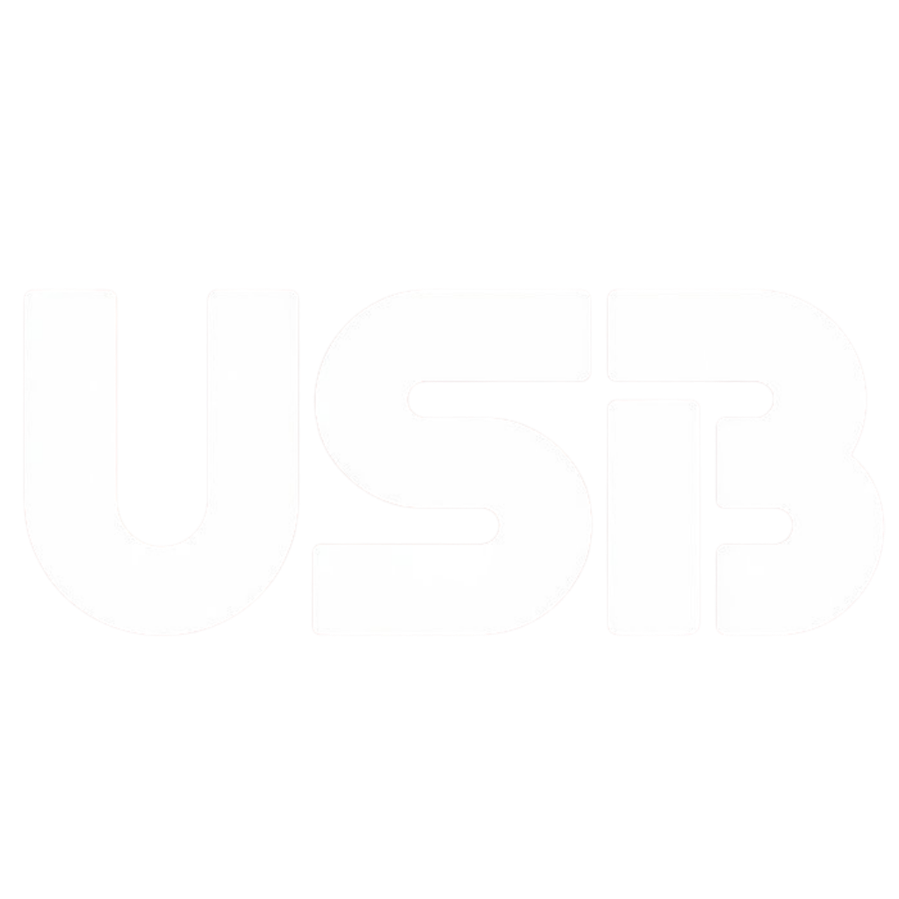

<!-- PLACEHOLDER IMAGE: USB wordmark/logo — light and dark variant, similar treatment to a project wordmark.
     Suggested size: ~320px wide, transparent background.
     Save as: docs/media/usb-wordmark-light.svg and docs/media/usb-wordmark-dark.svg -->
<!-- <picture>
  <source media="(prefers-color-scheme: dark)" srcset="./docs/media/usb-wordmark-dark.png">
  <source media="(prefers-color-scheme: light)" srcset="./docs/media/usb-wordmark-light.png">
  
</picture> -->

### University Schedule Builder

A browser extension for Mustaqbal University students to plan their semester schedule before or during registration.

 

 

### 📖 [Read in English](./README.en.md) &nbsp;&middot;&nbsp; [اقرأ بالعربية](./README.ar.md)

